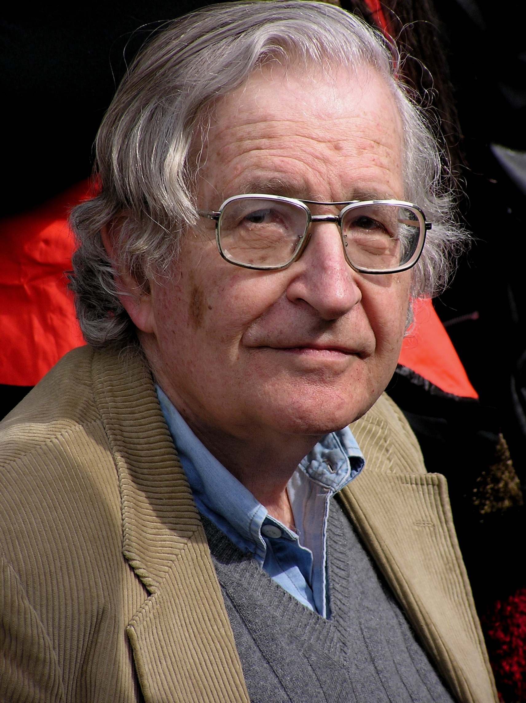
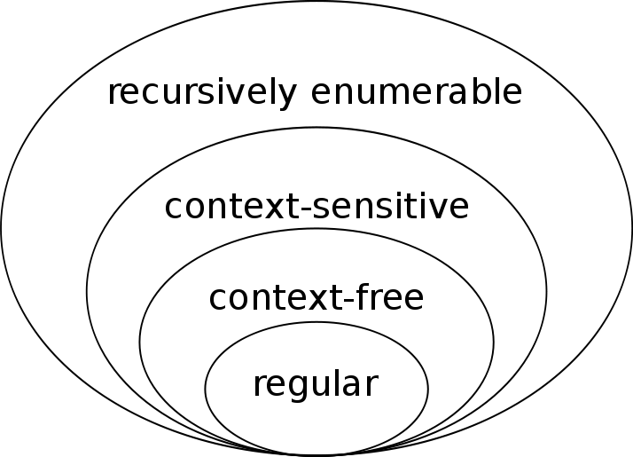

# Expresiones Regulares y autómatas finitos

---

---

---

### Alfabetos

Llamamos _alfabeto_ a un conjunto **finito** de símbolos.

<ul>
	<li class="fragment">$\Sigma = \\{0, 1\\}$</li>
	<li class="fragment">$\Sigma = \\{a, b\\}$</li>
	<li class="fragment">$\Sigma =$ `ASCII`</li>
	<li class="fragment">$\Sigma =$ `UTF-8`</li>
</ul>

---

### Cadenas

Dado un alfabeto $\Sigma$, una _cadena_ es una sucesión **finita** de símbolos
de $L$.

<ul>
	<li class="fragment">
		Si $\Sigma = \\{0, 1\\}$, $01010110$ es una cadena sobre $\Sigma$
	</li>
    <li class="fragment">
		Si $\Sigma = \\{a, b\\}$, $baba$ es una cadena sobre $\Sigma$
	</li>
	<li class="fragment">
		Si $\Sigma =$ `UTF-8`, $hola,$ $soy$ $max$ es una cadena sobre $\Sigma$
	</li>
</ul>

---

### Lenguajes

Un lenguaje $L$ **sobre una alfabeto** $\Sigma$ es un conjunto de cadenas hechas
con símbolos de $\Sigma$.

<ul>
	<li class="fragment">
		Si $\Sigma = \\{0, 1\\}$, $L = \\{0, 1, 001, 01\\}$
	</li>
	<li class="fragment">
		Si $\Sigma =$ `UTF-8`, $L = \\{x\ |\ x$ es un verbo en infinitivo $\\}$
	</li>

</ul>

---
😴 😴 😴 😴 😴
---

## Construyendo lenguajes

---

Sea $\Sigma$ un alfabeto y sea $L$ un lenguaje sobre $\Sigma$.

<ul>
	<li class="fragment">
		Para cualesquiera cadenas $x$ y $w$ de $L$, definimos a la _concatenación_
		de $x$ con $w$ como $z = xw$. Por ejemplo:
		<ul>
			<li class="fragment">
				Si $L = \\{a, b\\}$, $x = aab$ y $w = bba$, entonces
				$z = aabbbba$.
			</li>
		</ul>
	</li>
</ul>

---

Sean $L$ y $M$ dos lenguajes sobre $\Sigma$

<ul>
	<li class="fragment">
		A partir de ahora abreviaremos la notación $L = \\{a\\}$ a únicamente
		$a$.
	</li>
	<li class="fragment">
		Definimos la concatenación $L\cdotM$ de lenguajes como el lenguaje
		$$N = \\{xy\ |\  x \text{es cadena de }L, y \text{es cadena de }M\\}$$.
	</li>
</ul>
